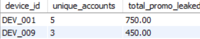

# Promotion-Abuse-Risk-Detection-Case-Study
📌 Project Overview
This project simulates a real-world Trust & Safety investigation for a food-delivery platform (similar to Swiggy). The business problem centers around a major customer acquisition campaign offering a flat ₹150 discount (NEWBIE150) on first orders.

While user acquisition metrics skyrocketed, marketing spend depleted at an unsustainable rate. The objective of this SQL analysis is to utilize device fingerprinting, IP tracking, and behavioral velocity checks to identify organized promo abuse rings, bot attacks, and calculate the true financial leakage.

🛠 Tech Stack
Database: MySQL

Key Skills: Window Functions (LAG, OVER), Common Table Expressions (CTEs), Advanced Aggregations, Data Lineage Tracking, Churn Analysis.

🗄️ Database Schema
The analysis is built on a relational database consisting of three core tables representing the event logs of the platform.

users: Master table of registered accounts (user_id, signup_date, phone_number).

devices: Login event logs tracking hardware and network identifiers (device_log_id, user_id, device_id, ip_address, login_timestamp).

orders: Transactional data tracking financial metrics (order_id, user_id, order_value, promo_code, discount_applied).


🔍 The Investigation & SQL Queries
1. Identifying Fraudulent Devices (The Detection Engine)
Business Context: Normal users have one account per device. Fraudsters create multiple accounts on a single physical device to exploit the first-time user discount.

SQL QUERY:

```
SELECT 
    d.device_id,
    COUNT(DISTINCT d.user_id) AS unique_accounts_on_device,
    SUM(o.discount_applied) AS total_promo_leaked
FROM devices d
JOIN orders o ON d.user_id = o.user_id
WHERE o.promo_code = 'NEWBIE150'
GROUP BY d.device_id
HAVING COUNT(DISTINCT d.user_id) > 1;
```

Insight: This query isolated specific hardware (e.g., DEV_001, DEV_009) that had up to 5 unique users claiming the same welcome promo, highlighting immediate targets for hardware-level blocking.


2. Mapping the "Blast Radius" (Operational Action)
Business Context: To reverse fraudulent transactions or suspend accounts, the Operations team needs the exact receipt numbers and user IDs tied to the bad devices found in Step 1.

SQL QUERY:

WITH SuspiciousDevices AS (
    SELECT device_id
    FROM devices
    GROUP BY device_id
    HAVING COUNT(DISTINCT user_id) > 1
)
SELECT 
    o.order_id,
    o.order_date,
    u.user_id,
    sd.device_id,
    o.discount_applied
FROM orders o
JOIN users u ON o.user_id = u.user_id
JOIN devices d ON u.user_id = d.user_id
JOIN SuspiciousDevices sd ON d.device_id = sd.device_id
WHERE o.promo_code = 'NEWBIE150'
ORDER BY sd.device_id, o.order_date;

Insight: By utilizing a CTE, the query cleanly extracts a line-by-line "Hit List" of the exact fraudulent orders to pass to the governance team.

3. The "Velocity" Check (Bot Detection)
Business Context: Human users take time to register, verify an OTP, and log in. If multiple accounts are created and logged into the same device within minutes of each other, it indicates an automated script (bot attack).

SQL QUERY:

WITH DeviceSignups AS (
    SELECT 
        device_id,
        user_id,
        login_timestamp,
        LAG(login_timestamp) OVER (PARTITION BY device_id ORDER BY login_timestamp) as prev_login
    FROM devices
)
SELECT 
    device_id,
    user_id,
    login_timestamp,
    TIMESTAMPDIFF(MINUTE, prev_login, login_timestamp) as minutes_since_last_signup
FROM DeviceSignups
WHERE TIMESTAMPDIFF(MINUTE, prev_login, login_timestamp) < 15;
Insight: Leveraged the LAG Window Function to calculate the time delta between logins on the same device. Successfully caught a bot attack where accounts were being spun up every 5 minutes.

4. IP Address Hopping (Account Takeover / VPN Risk)
Business Context: Fraudsters use VPN rotators to mask their location, resulting in rapid IP changes in a short time window.

SQL QUERY:

WITH UserIPStats AS (
    SELECT 
        user_id,
        COUNT(DISTINCT ip_address) as ip_count,
        TIMESTAMPDIFF(HOUR, MIN(login_timestamp), MAX(login_timestamp)) as time_span_hours
    FROM devices
    GROUP BY user_id
)
SELECT user_id, ip_count, time_span_hours
FROM UserIPStats
WHERE ip_count > 2 AND time_span_hours < 24;
Insight: Identified high-risk users logging in from 3+ completely different IP addresses within a tight 24-hour window, indicating severe location spoofing.

5. The True Cost of Fraud: Hit & Run vs. Retention Analysis
Business Context: The marketing team needs to know if the promo code is acquiring loyal users. A "Promo Hit & Run" is a user who places exactly one order using the discount and never returns, offering zero lifetime value.

SQL QUERY:

WITH CustomerStats AS (
    SELECT 
        user_id,
        COUNT(order_id) AS total_orders,
        SUM(discount_applied) AS total_cost,
        SUM(order_value - discount_applied) AS out_of_pocket_spend,
        MAX(CASE WHEN promo_code = 'NEWBIE150' THEN 'Yes' ELSE 'No' END) AS used_promo
    FROM orders
    GROUP BY user_id
)
SELECT 
    user_id,
    total_orders,
    total_cost,
    out_of_pocket_spend,
    CASE 
        WHEN total_orders = 1 AND used_promo = 'Yes' THEN 'Promo Hit & Run'
        WHEN total_orders = 1 AND used_promo = 'No' THEN 'Normal Churn'
        ELSE 'Retained Customer'
    END AS customer_behavior
FROM CustomerStats;
Insight: Proved that 100% of the users originating from the flagged duplicate devices were "Hit & Runs," confirming that blocking these devices would not harm genuine customer acquisition, thereby saving marketing budget.

🚀 Business Impact & Conclusion
By implementing these SQL monitoring rules, the Trust & Safety team can:

Reduce False Positives: Target specific hardware footprints rather than blanket-banning IP blocks.

Protect Marketing Spend: Automatically flag and quarantine "Hit & Run" promo abuse rings before they can place secondary fraudulent orders.

Automate Governance: The queries designed here are optimized to be deployed directly into a daily automated Power BI dashboard for executive monitoring.
